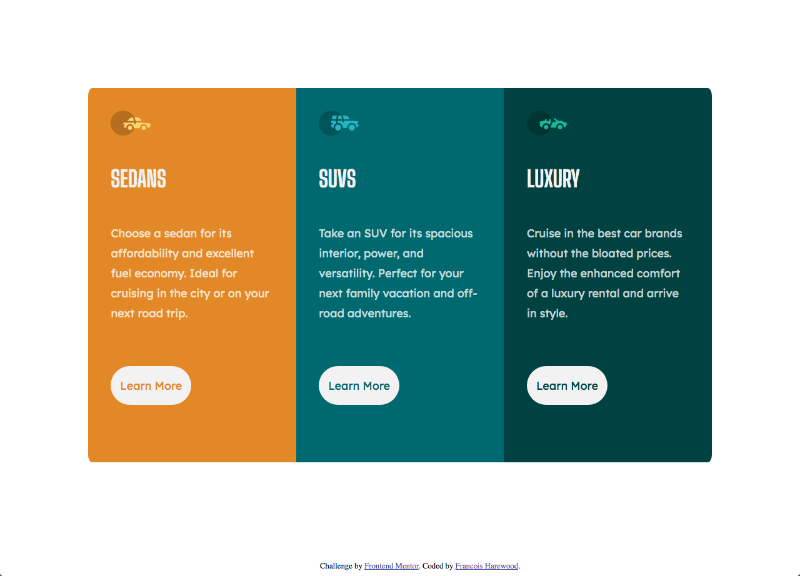

# Frontend Mentor - 3-column preview card component solution

This is a solution to the [3-column preview card component challenge on Frontend Mentor](https://www.frontendmentor.io/challenges/3column-preview-card-component-pH92eAR2-). Frontend Mentor challenges help you improve your coding skills by building realistic projects. 

## Table of contents

- [Overview](#overview)
  - [The challenge](#the-challenge)
  - [Screenshot](#screenshot)
  - [Links](#links)
- [My process](#my-process)
  - [Built with](#built-with)
  - [What I learned](#what-i-learned)
  - [Continued development](#continued-development)
  - [Useful resources](#useful-resources)
- [Author](#author)

**Note: Delete this note and update the table of contents based on what sections you keep.**

## Overview

### The challenge

Users should be able to:

- View the optimal layout depending on their device's screen size
- See hover states for interactive elements

### Screenshot

### Links

- Solution URL: [https://github.com/hexachordal/3-column-preview-card-component-main](https://github.com/hexachordal/3-column-preview-card-component-main)
- Live Site URL: [https://hexachordal.github.io/3-column-preview-card-component-main/](https://hexachordal.github.io/3-column-preview-card-component-main/)

## My process

### Built with

- Semantic HTML5 markup
- SASS
- CSS Grid
- Mobile-first workflow

### What I learned

For this project, I tried a mobile first approach as well as SASS. At first I did not find SASS any different than using CSS with classes but I think I avoided some rewriting of code by using SASS though it was difficult to test changes as easily using chrome dev tools. I also learned how to use live server feature in VSCode which saves me a lot of time with having to constantly reload in my chrome browser. Using SASS helped me organize my code better though by creating my variables first, mixins second then my media queries. 

### Continued development

After watching a video on responsive layout, I leared about the font weight property so I'll start using that from now on in my code. I would also want to fix the tablet layout since it looks a bit stretched and maybe add some animation for hovering over the buttons.

### Useful resources

- [Sass documentation](https://sass-lang.com/documentation) - The source for SASS simply put. It helped me easily see the difference between SASS and CSS as well as SCSS which I am not familiar with yet.
- [w3schools](https://www.w3schools.com/css/css_grid.asp) - Good for everything code-wise to be honest but I used it specifically for a refresher on grid.

## Author

- Website - [Francois Harewood](https://github.com/hexachordal)
- Frontend Mentor - [@hexachordal](https://www.frontendmentor.io/profile/hexachordal)

